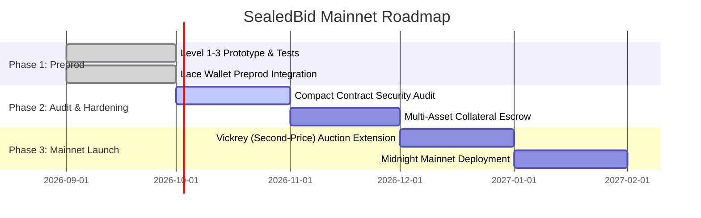

# Product Proposal: Sealed-Bid Auction on Midnight Network

> **Track**: Midnight Builder Challenge — Level 3: First Quarter  
> **Problem Statement**: Sealed-Bid Auction — private bids, verifiable winner  
> **Author**: Sharda Singh  
> **Date**: September 2026  

---

## 1. Executive Summary

Public blockchains are inherently transparent. In traditional English or Dutch auctions on transparent chains (like Ethereum or Polygon), every bid must be broadcast in plain text. This creates structural vulnerabilities:
- **Bid Sniping & Front-Running**: High-frequency bots monitor the mempool and outbid human participants in the final block.
- **Predatory Pricing**: Aggressive participants bid just enough to exceed competitors, eliminating true price discovery.
- **Privacy Leakage**: Corporate buyers, collectors, and institutions cannot participate without signaling their budget, balance, and strategic interests.

**SealedBid** is a decentralized, privacy-preserving auction dApp built natively on **Midnight Network**. Using Compact smart contracts and zero-knowledge proofs (ZK-SNARKs), bidders submit private valuations as client-side witnesses. When the auction concludes, the smart contract selectively discloses *only* the winning amount and a cryptographic commitment of the winner, leaving all losing bids and bidder identities completely sealed.

---

## 2. Target Audience & Use Cases

| User Persona | Key Pain Point on Transparent Chains | SealedBid Solution on Midnight |
|---|---|---|
| **Digital Art / NFT Collectors** | Bids are tracked by market whales; bidding signals drive prices up artificially | Bids stay completely private; whales cannot front-run or copy trades |
| **Enterprise / Government Procurement** | Public procurement laws often require blind tenders to avoid collusion | Tenders are cryptographically verified while preventing cartel collusion |
| **Real Estate & High-Value Assets** | Disclosing financing capacity exposes commercial negotiations | Only the successful purchase price is published upon deal closing |
| **Liquidations & DAO Treasury Sales** | On-chain liquidations trigger cascade dumps and MEV sandwiching | Sealed liquidations eliminate toxic MEV extraction |

---

## 3. Why Midnight Network?

Midnight's dual-state computing paradigm is uniquely suited for sealed-bid auctions:

1. **Selective Disclosure via `disclose()`**:
   Transparent chains have no built-in selective disclosure: data is either 100% public or held off-chain in centralized servers. Midnight's Compact language enables fine-grained disclosure directives. In SealedBid, the `highestBid` remains shielded during bidding and is disclosed strictly upon auction closure.

2. **Client-Side ZK Witness Execution**:
   Bidders compute their zero-knowledge proofs in their local browser environment (via Midnight's Proof Server and Lace wallet). The sensitive inputs (`bidderSecret`, `bidAmount`) never touch the network wire or the on-chain sequencer.

3. **Replay & Sybil Protection with Nullifiers**:
   By deriving transient nullifiers inside the circuit, the contract enforces one bid per secret key without needing to record the bidder's public key or wallet address.

4. **Regulatory & Audit Readiness**:
   Unlike mixer protocols or obfuscated chains, Midnight's architecture provides provable compliance. If needed in regulated commercial tenders, specific viewing keys can be shared with certified auditors without exposing bids to competitors.

---

## 4. Comprehensive Data Model

The table below defines every data field in the SealedBid system, its storage location, accessibility, and disclosure criteria:

| Data Field | Type | Storage Location | Accessibility | Disclosed To | Lifecycle / Purpose |
|---|---|---|---|---|---|
| `auctionName` | String | On-Chain (Public Ledger) | Public | Everyone | Set during auction creation to label the item. |
| `auctionOpen` | Boolean | On-Chain (Public Ledger) | Public | Everyone | State machine flag: true during bidding, false when closed. |
| `bidCount` | Counter | On-Chain (Public Ledger) | Public | Everyone | Incremented on each verified ZK bid submission. |
| `highestBid` | Uint | On-Chain (Public Ledger) | Selectively Disclosed | Everyone (post-close only) | Initialized to 0. Revealed strictly upon auction close via `disclose()`. |
| `winnerCommitment` | Hash32 | On-Chain (Public Ledger) | Selectively Disclosed | Everyone (post-close only) | Cryptographic hash identifying the winning bid without revealing the bidder. |
| `usedNullifiers` | Set<Hash32> | On-Chain (Public Ledger) | Public | Verifier / Sequencer | Prevents double-bidding without linking to identity. |
| `bidderSecret` | Bytes32 | Client Browser Storage | Private Witness | Local Prover Only | Generated locally on the user's device; never broadcast. |
| `bidAmount` | Uint | Client Browser Storage | Private Witness | Local Prover Only | Evaluated inside the ZK circuit; never broadcast or stored on-chain. |
| `losingBids` | Values | Client Browser Storage | Strictly Private | Nobody | Permanently confidential. Losing bids are never disclosed on-chain. |

---

## 5. Mainnet Feasibility & Roadmap

### 5.1 Technical Viability
- **Gas / Resource Efficiency**: The Compact circuit performs hash derivations and comparative threshold checks. These operations are computationally lightweight, generating ZK-SNARK proofs in under 2 seconds on standard client hardware.
- **Scalability**: By utilizing state commitments rather than recording individual bid histories on-chain, contract storage remains $O(1)$ regardless of whether 10 or 10,000 bids are submitted.
- **Tooling Compatibility**: Built using official Midnight.js SDK patterns, Compact 0.18+, and standard Lace DApp connector standards.

### 5.2 Mainnet Roadmap

1. **Phase 1 (Current - Preprod)**:
   - Full ZK sealed-bid mechanism with Lace wallet integration.
   - Comprehensive test suite and CI/CD automated pipeline.
2. **Phase 2 (Audit & Escrow)**:
   - Third-party formal verification of the Compact circuits.
   - Integration with Midnight native tokens (`tDUST` / `NIGHT`) for locked collateral deposits to eliminate frivolous bids.
3. **Phase 3 (Mainnet Deployment & Advanced Formats)**:
   - Implementation of **Vickrey Auctions** (second-price sealed-bid where the winner pays the second-highest bid amount, provably computed inside the ZK circuit).
   - Enterprise viewing key delegation for regulatory compliance.

---

## 6. Conclusion

SealedBid demonstrates the core value proposition of Midnight Network: enabling real-world economic interactions where **fairness requires privacy, and trust requires verification**. By decoupling valuation from public exposure, SealedBid brings institutional-grade auction integrity to decentralized finance.
