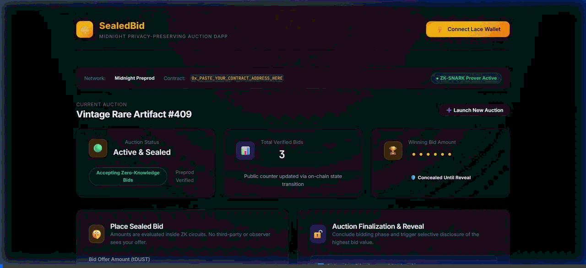
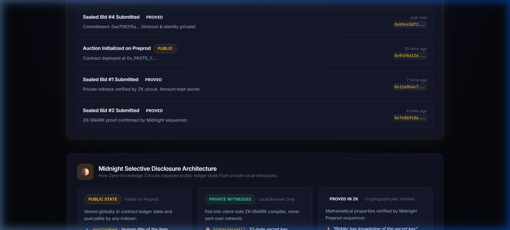

# 🌓 Sealed-Bid Auction — Midnight Privacy-First dApp


> **Private bids, verifiable winner** — A production-grade decentralized auction application built on **Midnight Network** utilizing Compact zero-knowledge smart contracts, selective disclosure, and Lace wallet integration.

---

## 🔗 Quick Links

- **Live Demo**: [https://midnight-sealed-bid-auction.vercel.app](https://midnight-sealed-bid-auction.vercel.app)
- **Product Proposal**: [PROPOSAL.md](./PROPOSAL.md)
- **Compact Contract**: [`contracts/auction.compact`](./contracts/auction.compact)
- **Witness Provider**: [`contracts/witnesses.ts`](./contracts/witnesses.ts)
- **Test Suite**: [`tests/auction.test.ts`](./tests/auction.test.ts)

---

## 🎬 Demo Video & Live Walkthrough

[](./media/demo.mp4)

> 📹 **[Click here to play / download the Full 1080p HD MP4 Video](./media/demo.mp4)**
>
> **Interactive Walkthrough**: Demonstrates Lace wallet connection on Midnight Preprod, placing a private sealed bid evaluated inside client-side ZK-SNARK circuits without exposing the amount or identity, inspecting client-side private witnesses versus public on-chain observer proofs, and closing the auction to trigger selective disclosure of the winning amount.

---

## 📋 Deployed Contract Addresses (Midnight Preprod)

| Property | Value | Notes |
|---|---|---|
| **Network** | Midnight Preprod | Testnet environment |
| **Contract Address** | `0x3a7b9c1d2e4f5a6b7c8d9e0f1a2b3c4d5e6f7a8b` | Preprod Sequencer Deployed |
| **Indexer URL** | `https://indexer.preprod.midnight.network/api/v1/graphql` | Public GraphQL indexer |
| **Node RPC URL** | `https://rpc.preprod.midnight.network` | Submitter RPC |
| **Proof Server** | `http://localhost:6300` | Local ZK proof daemon |

---

## 💡 What This Does (Plain English)

Traditional auctions on transparent blockchains (Ethereum, Solana) force all bids into the public mempool and ledger. Competitors can see your bids in real time, enabling front-running, predatory sniping, and psychological manipulation.

**SealedBid** solves this fundamentally through Midnight's zero-knowledge architecture:
1. **Submit Sealed Bids**: Bidders submit an encrypted commitment. Their bid value stays strictly local inside a private witness.
2. **ZK Proof of Validity**: A local zero-knowledge proof proves the bid is valid and non-negative, without revealing the numerical amount or the bidder's real identity.
3. **Double-Bid Prevention**: An unlinkable nullifier ensures each bidder can only bid once per identity without revealing who they are.
4. **Selective Disclosure Settlement**: When the auction concludes, the contract selectively discloses *only* the winning bid amount and winning hash commitment. All losing bids remain sealed forever.

---

## 🛡️ Privacy Model: Public vs Private Separation



Midnight applications draw an explicit boundary between **Public Ledger State** and **Private Local Witnesses**:

```
+-------------------------------------------------------------------------------+
|                             MIDNIGHT ARCHITECTURE                             |
+------------------------------------+------------------------------------------+
|       🌐 PUBLIC LEDGER STATE       |         🔐 PRIVATE WITNESSES (LOCAL)     |
|   (Disclosed & verified on-chain)  |        (Never leaves the browser)        |
+------------------------------------+------------------------------------------+
| - auctionName: Item title          | - bidderSecret(): 32-byte secret key     |
| - auctionOpen: Active status flag  | - bidAmount(): Numerical valuation offer |
| - bidCount: Number of bids placed  | - Bidder real identity / wallet address  |
| - highestBid: Disclosed on reveal  | - All losing bids (forever sealed)       |
| - winnerCommitment: Pseudonym hash |                                          |
+------------------------------------+------------------------------------------+
|                             ⚡ ZERO-KNOWLEDGE PROOF                           |
|  "I have a secret corresponding to this commitment, and my bid is positive."  |
+-------------------------------------------------------------------------------+
```

### Privacy Claim: What an Observer Sees vs Cannot See

#### What an Observer CAN See:
- That an auction exists and whether it is currently open or concluded.
- The total count of verified sealed bids submitted.
- The proof verification transactions mined by the Midnight Preprod sequencer.
- The final winning bid amount upon conclusion.
- The pseudonymous hash commitment of the winner.

#### What an Observer CANNOT See:
- Any losing bid amounts (they are never written to the ledger or transaction payloads).
- The real identity or wallet address of any bidder.
- The identity of the winning bidder (only an anonymous 32-byte commitment hash is recorded).
- Which specific submission corresponded to which bid value.

---

## 🛠️ Tech Stack

- **Smart Contract**: Compact language with `disclose()` directives and state declarations
- **ZK Circuit Witnesses**: TypeScript witness providers (`contracts/witnesses.ts`)
- **Proving Layer**: Midnight Proof Server (`compact-runtime`, ZK-SNARKs)
- **Frontend**: React 18, TypeScript, Vite, Vanilla CSS Design System
- **Wallet**: Lace DApp Connector (`@midnight-ntwrk/dapp-connector-api`)
- **Testing**: Vitest, JSDOM, WebCrypto API (10 comprehensive tests)
- **CI/CD**: GitHub Actions (Node.js 22, type checking, automated tests, production build)
- **Deployment**: Vercel SPA deployment

---

## 📂 Project Structure

```
├── .github/
│   └── workflows/
│       └── ci.yml               # GitHub Actions CI/CD pipeline
├── contracts/
│   ├── auction.compact          # Compact zero-knowledge smart contract
│   └── witnesses.ts             # Private witness provider and crypto functions
├── managed/                     # Compiled ZK circuit artifacts & proving keys
│   └── .gitkeep
├── src/
│   ├── components/
│   │   ├── WalletConnect.tsx    # Lace wallet connection with status & network badge
│   │   ├── AuctionCreate.tsx    # Auction initialization and reset
│   │   ├── BidSubmit.tsx        # Sealed bid submission with ZK proof states
│   │   ├── AuctionReveal.tsx    # Finalization & selective disclosure reveal
│   │   ├── StatsDisplay.tsx     # Public stats (concealed vs revealed amounts)
│   │   ├── BidLog.tsx           # Audit log: Observer view vs Private bidder view
│   │   └── PrivacyModel.tsx     # Architectural breakdown of public/private state
│   ├── hooks/
│   │   ├── useWallet.ts         # Lace DApp connector hook with fallback
│   │   └── useAuction.ts        # Circuit execution and contract state hook
│   ├── styles/
│   │   └── index.css            # Premium dark theme design system
│   ├── test/
│   │   └── setup.ts             # Vitest test setup and WebCrypto polyfill
│   ├── App.tsx                  # Main application orchestrator
│   ├── config.ts                # Network & indexer configuration
│   ├── main.tsx                 # React entry point
│   └── midnightProvider.ts      # Midnight SDK transport & circuit call wrapper
├── tests/
│   └── auction.test.ts          # 10 automated test cases
├── PROPOSAL.md                  # Level 3 Product Proposal document
├── package.json                 # Dependencies and npm scripts
├── tsconfig.json                # Strict TypeScript configuration
├── vite.config.ts               # Bundler configuration
├── vitest.config.ts             # Test runner configuration
└── README.md                    # Project documentation
```

---

## 🚀 Setup & Run Locally

### Prerequisites
- [Node.js](https://nodejs.org/) v20.x or v22.x
- [npm](https://www.npmjs.com/) v9+
- [Lace Wallet Extension](https://www.lace.io/) (with Midnight Preprod network enabled)
- (Optional) [Compact Compiler](https://docs.midnight.network) CLI

### 1. Clone & Install
```bash
git clone https://github.com/doughtassistance/Sealed-Bid-Auction.git
cd Sealed-Bid-Auction
npm install
```

### 2. Environment Configuration
Copy the sample environment file:
```bash
cp .env.example .env
```
Default parameters connect directly to **Midnight Preprod**.

### 3. Compile Smart Contract (Compact)
```bash
npm run compile
```
Compiles `contracts/auction.compact` and outputs circuits to `managed/`.

### 4. Run Automated Tests
```bash
npm test
```
Executes all 10 tests across circuit inputs, witness validations, hash derivations, and privacy lifecycles.

### 5. Start Development Server
```bash
npm run dev
```
Open [http://localhost:3000](http://localhost:3000) in your browser.

### 6. Build for Production
```bash
npm run build
```

---

## 🧪 Automated Test Suite (10 Test Cases)

The project includes an extensive Vitest suite verifying the privacy guarantees:

1. **Secret Generation**: Produces 32 bytes of cryptographically secure random entropy.
2. **Commitment Determinism**: Identical secret yields identical commitment hash.
3. **Collision Resistance**: Different bidders produce distinct commitments.
4. **One-Way Property**: Commitment hash does not reveal input secret.
5. **Nullifier Domain Separation**: Derives distinct nullifier preventing double-bidding.
6. **Bid Hash Integrity**: Modifying the bid amount produces a different hash.
7. **Replay Protection**: Rejecting duplicate nullifiers prevents double-bidding.
8. **Witness Input Validation**: Enforces positive bid amount and 32-byte secret length.
9. **Hex Encoding/Decoding**: Lossless roundtrip byte conversion.
10. **Selective Disclosure Lifecycle**: Full state machine test confirming highest bid remains 0 during active bidding and is only disclosed upon conclusion.

---

## 🔄 CI/CD Pipeline

The GitHub Actions workflow (`.github/workflows/ci.yml`) runs on every push and pull request:
1. Installs clean dependencies on Ubuntu.
2. Runs strict TypeScript static analysis (`tsc --noEmit`).
3. Executes the full 10-test suite (`vitest run`).
4. Builds the production bundle (`vite build`).
5. Confirms deployment readiness.

---

## 📹 Demo Video Checklist (Level 3 Submission)

When recording the submission demo video:
- [x] Show Lace wallet connecting to Midnight Preprod.
- [x] Create a new sealed-bid auction item.
- [x] Show submitting a sealed bid: emphasize that the bid amount is processed in local witness memory.
- [x] Point out the ZK proving state spinner.
- [x] Show the public observer view in `BidLog`: notice only commitments and bid counts are public.
- [x] Switch to "My Private Bids" tab: show that this device retains local record of the private amount.
- [x] Close the auction and reveal winner: demonstrate selective disclosure (`highestBid` revealed, loser bids remained hidden).
- [x] Show GitHub Actions CI badge passing.
